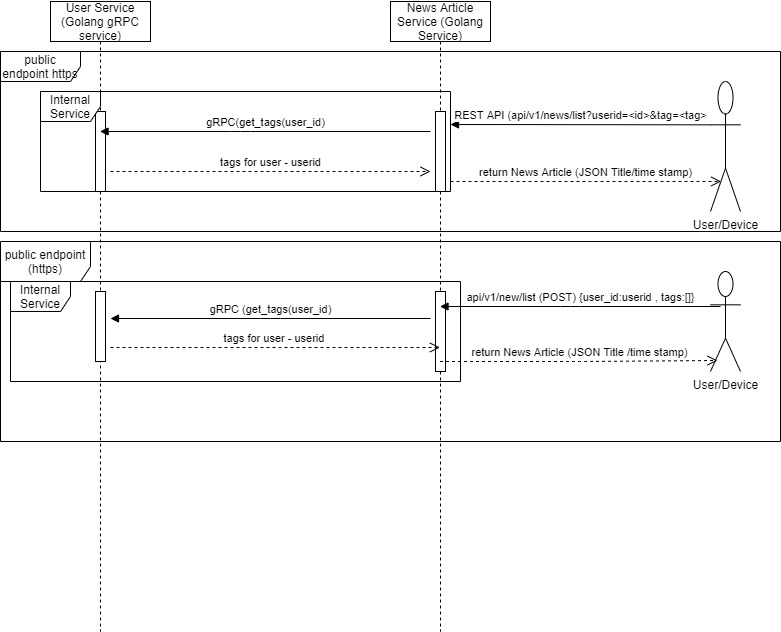

Overview

This is a framework to deliver news articles to the users from different sources.
REST API sould be exposed for the users to get the news articles what they are subscribed to.

Design overview

The whole solution is implemented as two microservices
1) User Service - Internal service
2) News Article Service

News article service will expose the REST API as below .At the moment this is implemented as http end point, This can be implemented as https with an nginx ingress controller or plain https server with JWT based authentication

How to build the project
========================

Project can be built as 

make clean;make

Testing
=======
We need to start both the services to test this end to end

Initiate the user_service as
user_service/user_service 

Initiate the news article service as 
news_article_service/news_article_service

Testing of REST API endpoint(Eg: using curl)
=============================================

curl -i -H "Content-Type: application/json" -d '{"userid":"user4", "tags":["sports"]}' -X POST http://localhost:8000/api/v1/news_list/

HTTP/1.1 200 OK
Date: Sun, 24 Jan 2021 17:13:53 GMT
Content-Length: 544
Content-Type: text/plain; charset=utf-8

[{"Title":"News title 1","Timestamp":"2021-01-24T17:13:24.485693455Z","Tags":["sports"]},{"Title":"News title 3","Timestamp":"2021-01-24T17:13:24.485699813Z","Tags":["live","sports"]},{"Title":"News title 4","Timestamp":"2021-01-24T17:13:24.485700993Z","Tags":["sports"]},{"Title":"News title 7","Timestamp":"2021-01-24T17:13:24.485704515Z","Tags":["sports"]},{"Title":"News title 8","Timestamp":"2021-01-24T17:13:24.485705706Z","Tags":["sports","live"]},{"Title":"News title 9","Timestamp":"2021-01-24T17:13:24.485706888Z","Tags":["sports"]}]

ubuntu@ip-172-31-42-238:~/GOTEST/sajjanj-interview-test$ curl -i -H "Content-Type: application/json" -d '{"userid":"user4", "tags":["sports1"]}' -X POST http://localhost:8000/api/v1/news_list/

HTTP/1.1 200 OK
Date: Sun, 24 Jan 2021 17:14:05 GMT
Content-Length: 3
Content-Type: text/plain; charset=utf-8

[]

curl -i -H "Content-Type: application/json" -d '{"userid":"user1", "tags":["live","sports"]}' -X POST http://localhost:8000/api/v1/news_list/

HTTP/1.1 200 OK
Date: Sun, 24 Jan 2021 17:41:14 GMT
Content-Length: 1079
Content-Type: text/plain; charset=utf-8

[{"Title":"News title 1","Timestamp":"2021-01-24T17:40:04.479910186Z","Tags":["sports"]},{"Title":"News title 2","Timestamp":"2021-01-24T17:40:04.479915538Z","Tags":["live"]},{"Title":"News title 3","Timestamp":"2021-01-24T17:40:04.479916786Z","Tags":["live","sports"]},{"Title":"News title 3","Timestamp":"2021-01-24T17:40:04.479916786Z","Tags":["live","sports"]},{"Title":"News title 4","Timestamp":"2021-01-24T17:40:04.479917973Z","Tags":["sports"]},{"Title":"News title 5","Timestamp":"2021-01-24T17:40:04.479919149Z","Tags":["live"]},{"Title":"News title 6","Timestamp":"2021-01-24T17:40:04.479920329Z","Tags":["live"]},{"Title":"News title 7","Timestamp":"2021-01-24T17:40:04.479921495Z","Tags":["sports"]},{"Title":"News title 8","Timestamp":"2021-01-24T17:40:04.479922663Z","Tags":["sports","live"]},{"Title":"News title 8","Timestamp":"2021-01-24T17:40:04.479922663Z","Tags":["sports","live"]},{"Title":"News title 9","Timestamp":"2021-01-24T17:40:04.479923838Z","Tags":["sports"]},{"Title":"News title 10","Timestamp":"2021-01-24T17:40:04.479925011Z","Tags":["live"]}]

Unit Testing
============

Unit test suites are situated in news_article_service and user_service paths.

TODO
=====
Time based filtering  - This can be easily acheived by a database (SQL queries supports time based filtering, In this implementation this is memory based database)

Authentication - JWT based autnentication is possible / nginx ingress controller can be configured for https endpoint 
